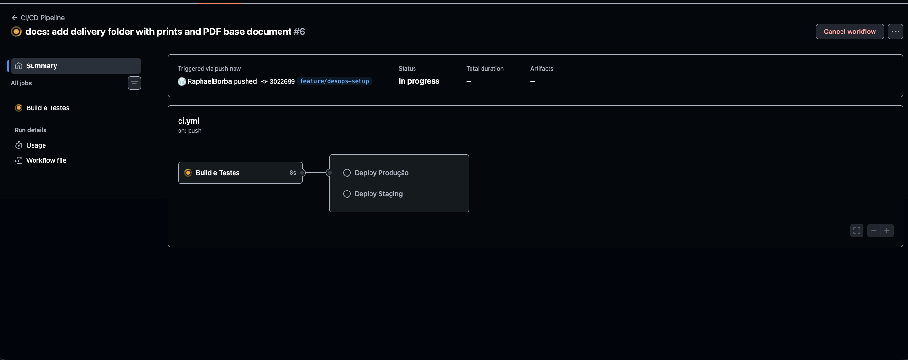
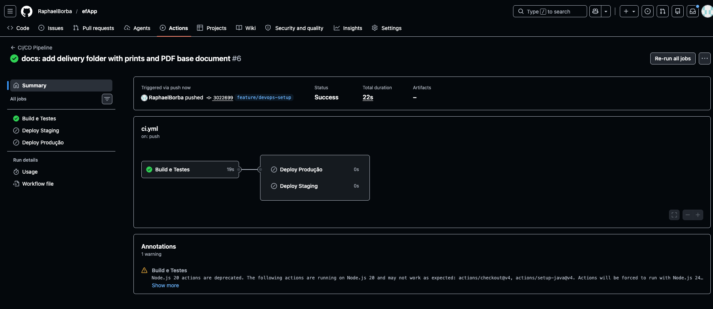
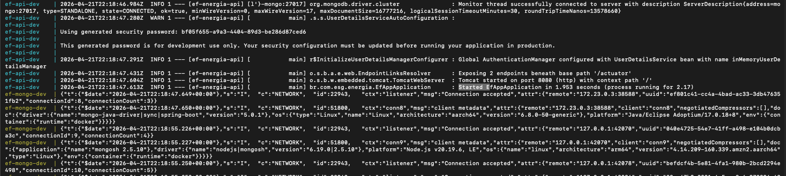
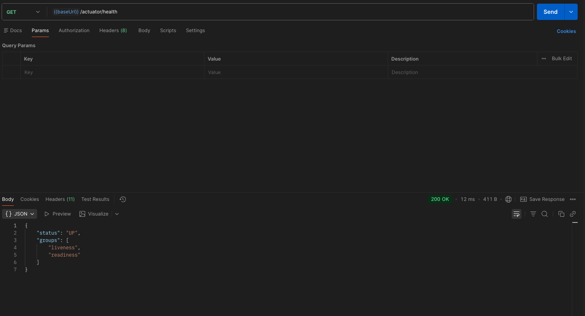
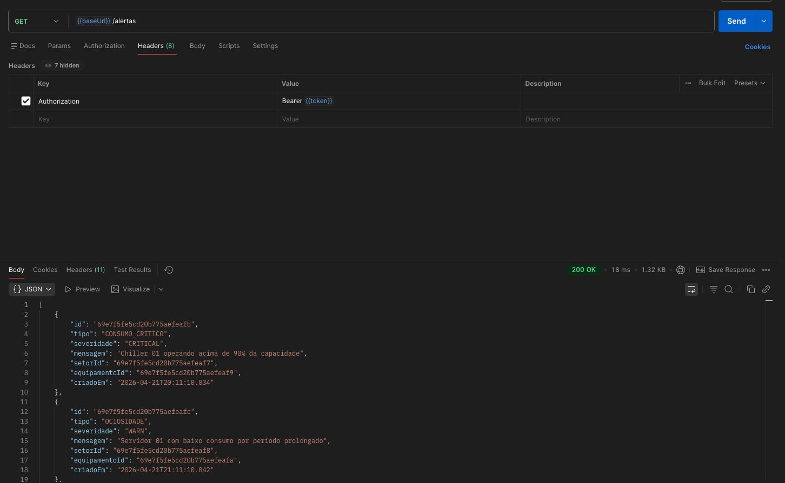

# EF Energia — Cidades ESG Inteligentes
## Documentação Técnica — DevOps

**Integrantes:** [SEU NOME AQUI]  
**Curso:** [SEU CURSO]  
**Data:** Abril de 2026

---

## 1. Descrição do Projeto

API REST de Eficiência Energética com tema ESG (Environmental, Social, Governance), desenvolvida em Java Spring Boot 3.3.3 com MongoDB. A aplicação monitora o consumo energético por setor, gerencia equipamentos, processa leituras de sensores IoT, gera alertas automáticos e valida metas mensais de consumo.

---

## 2. Pipeline CI/CD

### Ferramenta utilizada
**GitHub Actions** — configurado em `.github/workflows/ci.yml`

### Lógica de disparo

| Branch | Jobs executados |
|---|---|
| `feature/*`, `develop`, `main` | Build e Testes |
| `develop` | Build e Testes → Deploy Staging |
| `main` | Build e Testes → Deploy Produção |

### Etapas do pipeline

**Job 1 — Build e Testes**
1. Checkout do código
2. Setup Java 17 (Temurin) com cache Maven
3. `mvn clean package -DskipTests` — compila o projeto
4. `mvn test` — executa os 24 testes unitários

**Job 2 — Deploy Staging** *(apenas branch develop)*
1. Build da imagem Docker (`./api`)
2. `docker compose -f docker-compose.staging.yml up -d --build`
3. Healthcheck: `curl http://localhost:8081/actuator/health`

**Job 3 — Deploy Produção** *(apenas branch main)*
1. Build da imagem Docker (`./api`)
2. `docker compose -f docker-compose.prod.yml up -d --build`
3. Healthcheck: `curl http://localhost:8080/actuator/health`

### Testes automatizados — 24 testes, 0 falhas

| Classe | Testes | Cobertura |
|---|---|---|
| `EquipamentoServiceTest` | 10 | CRUD, validações, filtro por setor |
| `LeituraServiceTest` | 5 | Registro, geração de alerta crítico, acúmulo diário |
| `AlertaServiceTest` | 5 | Filtros por tipo, setor, equipamento e período |
| `GovernancaServiceTest` | 4 | Validação de meta mensal, alerta META_EXCEDIDA |

---

## 3. Docker — Containerização

### Dockerfile

```dockerfile
FROM eclipse-temurin:17
WORKDIR /app

RUN apt-get update && apt-get install -y maven && rm -rf /var/lib/apt/lists/*

COPY pom.xml .
RUN mvn dependency:go-offline -DskipTests

COPY src ./src
RUN mvn clean package -DskipTests
RUN mv target/*.jar app.jar

EXPOSE 8080
ENTRYPOINT ["java", "-jar", "app.jar"]
```

**Estratégias adotadas:**
- `dependency:go-offline` antes de copiar o `src/` — reutiliza a camada de dependências enquanto só o código muda, acelerando rebuilds
- `rm -rf /var/lib/apt/lists/*` — reduz o tamanho da imagem
- Testes executados no pipeline, não na imagem (`-DskipTests`)

### Arquitetura dos ambientes

| Ambiente | Arquivo | Porta API | Banco | Restart |
|---|---|---|---|---|
| Desenvolvimento | `docker-compose.yml` | 8080 | efenergia_dev | unless-stopped |
| Staging | `docker-compose.staging.yml` | 8081 | efenergia_staging | unless-stopped |
| Produção | `docker-compose.prod.yml` | 8080 | efenergia_prod | always |

Cada ambiente possui rede bridge e volume nomeado isolados.

### Comandos utilizados

```bash
# Desenvolvimento
docker-compose up --build

# Staging
docker-compose -f docker-compose.staging.yml up --build

# Produção
export APP_JWT_SECRET=seu_segredo
docker-compose -f docker-compose.prod.yml up --build
```

---

## 4. Prints do pipeline rodando

### Pipeline em execução — Build e Testes rodando


### Pipeline concluído — Status: Success (22s)


---

## 5. Prints dos ambientes funcionando

### API iniciando (docker-compose up)


### Health check — ambiente de desenvolvimento


### Endpoint /alertas retornando dados


---

## 6. Desafios encontrados e soluções

### Desafio 1 — JWT secret inválido no Docker Compose
**Problema:** A API não subia ao rodar via Docker Compose. O erro era `DecodingException: Illegal base64 character: '_'`. O valor padrão definido para o `APP_JWT_SECRET` continha underscores, que não são caracteres Base64 válidos — e a biblioteca JJWT exige que o segredo seja Base64.

**Solução:** Substituído o valor padrão por uma string Base64 válida (`bXlzdXBlcnNlY3JldGtleWZvcmp3...`), que é o mesmo segredo já usado no `application.yml`.

### Desafio 2 — Caminho errado no docker build do pipeline
**Problema:** O pipeline original tinha `docker build -t smart-energy .` apontando para a raiz do projeto, mas o `Dockerfile` está dentro da pasta `api/`.

**Solução:** Corrigido para `docker build -t ef-energia-api ./api`.

### Desafio 3 — Maven Wrapper sem o JAR
**Problema:** O script `mvnw` não funcionava localmente porque o arquivo `maven-wrapper.jar` não estava no repositório.

**Solução:** Para o pipeline CI/CD, usamos o Maven instalado diretamente pelo GitHub Actions via `setup-java`, eliminando a dependência do wrapper.

---

## 7. Tecnologias utilizadas

| Categoria | Tecnologia | Versão |
|---|---|---|
| Linguagem | Java | 17 |
| Framework | Spring Boot | 3.3.3 |
| Banco de dados | MongoDB | 6 |
| Autenticação | JWT (JJWT) | 0.11.5 |
| Containerização | Docker + Docker Compose | 24+ |
| CI/CD | GitHub Actions | — |
| Build | Maven | 3.9.4 |
| Testes | JUnit 5 + Mockito + AssertJ | — |

---

## 8. Checklist de entrega

| Item | Status |
|---|---|
| Projeto compactado em .ZIP com estrutura organizada | ☐ |
| Dockerfile funcional | ✅ |
| docker-compose.yml ou arquivos Kubernetes | ✅ |
| Pipeline com etapas de build, teste e deploy | ✅ |
| README.md com instruções e prints | ✅ |
| Documentação técnica com evidências (PDF ou PPT) | ☐ |
| Deploy realizado nos ambientes staging e produção | ✅ |
